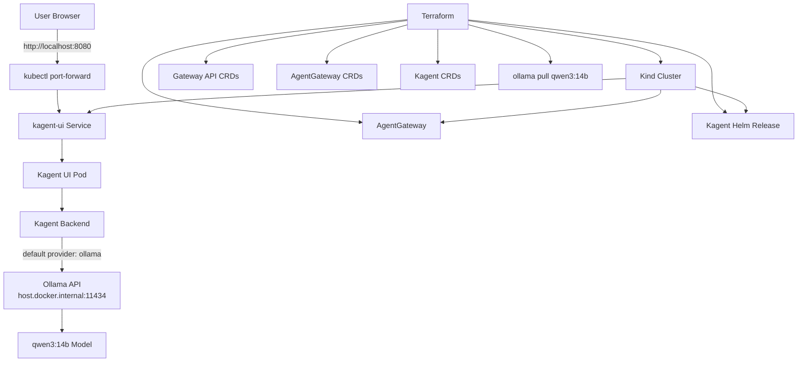

# Kagent on Kind with Terraform, AgentGateway, and Ollama


A local Kubernetes-based AI agent playground deployed with **Terraform** on a **Kind** cluster. The stack installs **Gateway API**, **AgentGateway**, **Kagent**, and connects Kagent to a locally running **Ollama** model (`qwen3:14b`).

This setup is useful for local development, demos, experimentation, and validating the deployment flow before moving to a larger Kubernetes environment.

---

## Overview

This project provisions and configures:

- a local **Kind** Kubernetes cluster
- **Gateway API** experimental CRDs
- **AgentGateway** CRDs and controller via Helm
- local **Ollama** model pull for `qwen3:14b`
- **Kagent** CRDs and application via Helm
- Kagent configured to use **Ollama** as the default provider

Kagent UI can be accessed locally using:

```bash
kubectl port-forward -n kagent svc/kagent-ui 8080:8080
```

Then open:

```text
http://localhost:8080
```

---

## Architecture

The deployment flow is:

1. Terraform creates the local Kind cluster.
2. Gateway API CRDs are installed.
3. AgentGateway CRDs and AgentGateway are installed with Helm.
4. Ollama pulls the `qwen3:14b` model on the host machine.
5. Kagent CRDs and Kagent are installed with Helm.
6. Kagent connects to Ollama via `http://host.docker.internal:11434`.
7. The Kagent UI is exposed locally through `kubectl port-forward`.

### Block Diagram



---

## Requirements

### Software

Make sure the following tools are installed and available in your `PATH`:

- **Terraform** `>= 1.14`
- **kubectl** compatible with your Kubernetes version
- **Helm** `>= 3.1`
- **Docker** (Docker Engine or Docker Desktop)
- **Ollama**

### System Requirements

Recommended minimum for a smoother experience with `qwen3:14b`:

- **CPU:** modern 8-core CPU or better
- **RAM:** at least **16 GB**, preferably **32 GB**
- **Disk:** at least **20 GB** free space
- **GPU:** a **dedicated GPU** is strongly recommended for better inference speed

### GPU Notes

`qwen3:14b` can be very heavy for a small laptop.

Recommended:

- NVIDIA GPU with sufficient VRAM for local inference
- or a powerful discrete/external GPU setup if your workstation supports it

Without a GPU, the stack may still work in CPU mode, but responses can be slow and host resource usage can be high.

### Networking Notes

This setup expects Kagent to reach Ollama at:

```text
http://host.docker.internal:11434
```

This usually works well with Docker Desktop environments. On some Linux setups, `host.docker.internal` may require additional configuration.

---

## Project Components

The provided Terraform configuration includes:

- `module "kind_cluster"` – creates the local Kind cluster
- `null_resource.install_gatewayapi` – installs Gateway API CRDs from the official release manifest
- `helm_release.agentgateway_crds` – installs AgentGateway CRDs
- `helm_release.agentgateway` – installs AgentGateway
- `null_resource.manage_ollama_model` – pulls the `qwen3:14b` model locally with Ollama
- `helm_release.kagent_crds` – installs Kagent CRDs
- `helm_release.kagent` – installs Kagent and configures it to use Ollama

Kagent provider-related values:

```hcl
providers.default = "ollama"
providers.ollama.provider = "Ollama"
providers.ollama.model = "qwen3:14b"
providers.ollama.config.host = "http://host.docker.internal:11434"
```

---

## Prerequisites

Before deployment:

1. Start Docker.
2. Make sure Kind can create clusters locally.
3. Install and start Ollama.
4. Verify Ollama is reachable:

```bash
ollama list
curl http://localhost:11434/api/tags
```

5. Ensure Terraform can access your Kubernetes and Helm providers.

---

## Initialization

Initialize Terraform in the project directory:

```bash
terraform init
```

Validate the configuration:

```bash
terraform validate
```

Review the execution plan:

```bash
terraform plan
```

---

## Deployment

Apply the infrastructure:

```bash
terraform apply
```

Terraform will:

- create the Kind cluster
- install Gateway API
- install AgentGateway
- pull the Ollama model `qwen3:14b`
- install Kagent

---

## Verify the Deployment

Check cluster nodes:

```bash
kubectl get nodes
```

Check namespaces:

```bash
kubectl get ns
```

Check Kagent resources:

```bash
kubectl get pods -n kagent
kubectl get svc -n kagent
```

Check AgentGateway resources:

```bash
kubectl get pods -n agentgateway-system
```

---

## Access Kagent UI

Use port-forward to access the UI locally:

```bash
kubectl port-forward -n kagent svc/kagent-ui 8080:8080
```

Open the UI in your browser:

```text
http://localhost:8080
```

---

## Example Workflow

A typical local workflow:

```bash
terraform init
terraform plan
terraform apply -auto-approve
kubectl get pods -n kagent
kubectl port-forward -n kagent svc/kagent-ui 8080:8080
```

---

## Troubleshooting

### 1. Ollama is not reachable from Kagent

Check that Ollama is running on the host:

```bash
curl http://localhost:11434/api/tags
```

If Kagent cannot reach `host.docker.internal`, verify your Docker/Kind networking setup.

### 2. Model pull takes a long time

`qwen3:14b` is a large model. Initial download can take significant time depending on bandwidth and disk performance.

Check downloaded models:

```bash
ollama list
```

### 3. Pods are not starting

Inspect pods and events:

```bash
kubectl get pods -A
kubectl describe pod -n kagent <pod-name>
kubectl logs -n kagent <pod-name>
```

### 4. Port-forward fails

Verify the service exists:

```bash
kubectl get svc -n kagent
```

Then retry:

```bash
kubectl port-forward -n kagent svc/kagent-ui 8080:8080
```

### 5. Terraform Helm resources fail

Make sure:

- the Kind cluster is up
- your local kubeconfig points to the Kind cluster
- Helm can access the cluster

Check current context:

```bash
kubectl config current-context
```

---

## Cleanup

To destroy the environment:

```bash
terraform destroy
```

Note: the destroy provisioner stops the Ollama model process:

```bash
ollama stop qwen3:14b
```

---

## Notes

- This setup is intended primarily for **local development and testing**.
- Running large local LLMs can consume substantial CPU, memory, disk, and GPU resources.
- For production-style environments, consider replacing the local Kind + host Ollama pattern with a more robust Kubernetes-based inference backend.

---

## Repository Goal

This repository demonstrates how to combine:

- **Terraform** for repeatable infrastructure provisioning
- **Kind** for local Kubernetes
- **Helm** for application installation
- **Ollama** for local LLM serving
- **Kagent** for agent interaction UI
- **AgentGateway** for gateway-layer capabilities

into one reproducible local AI platform.
