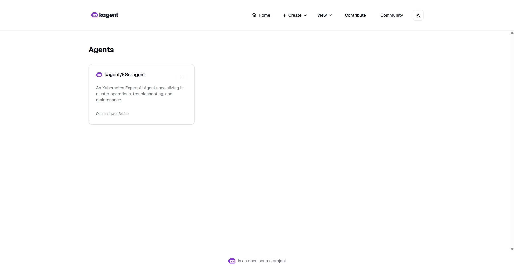
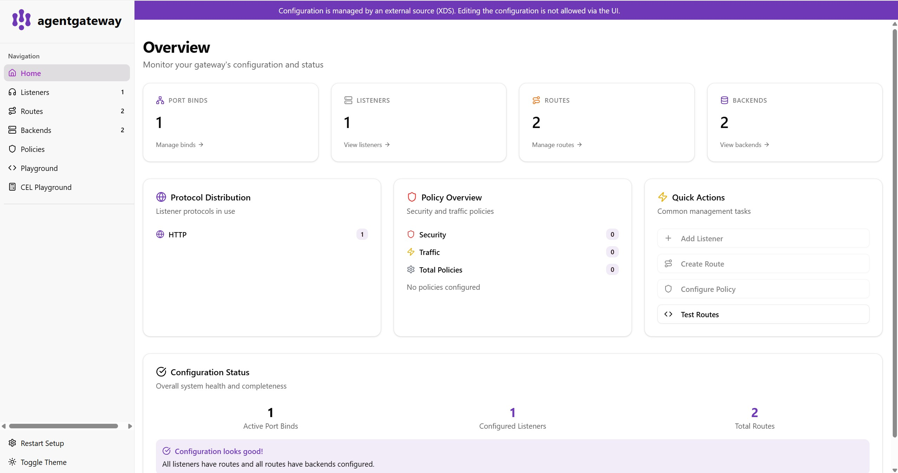
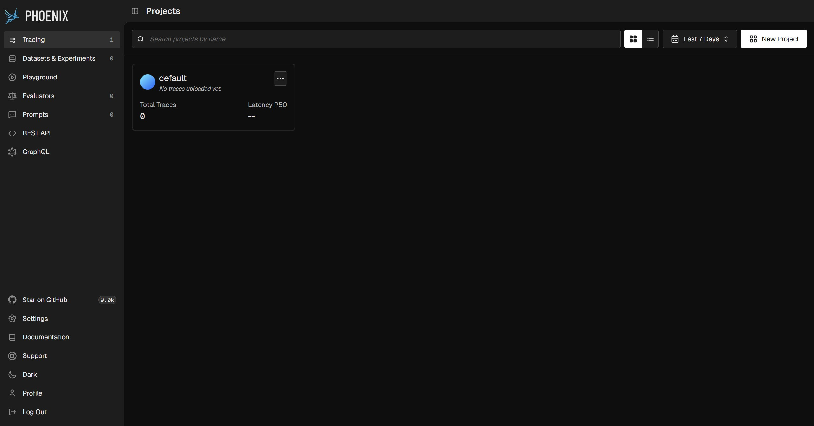
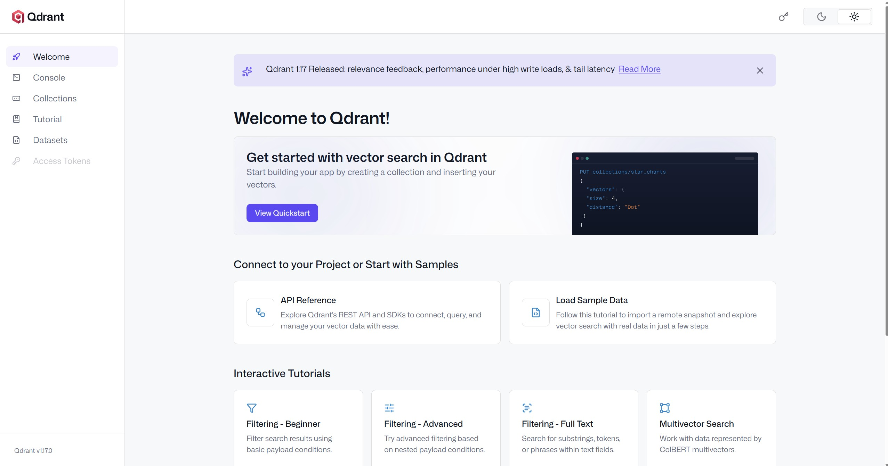
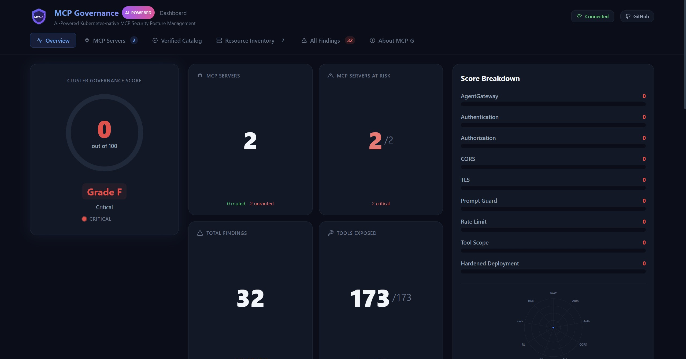
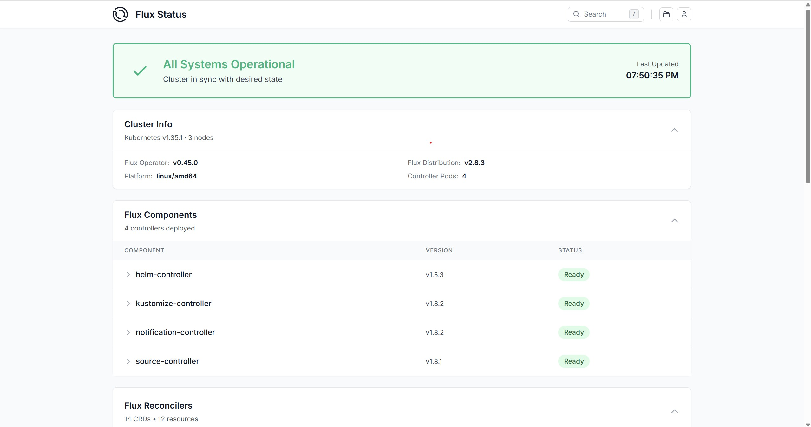
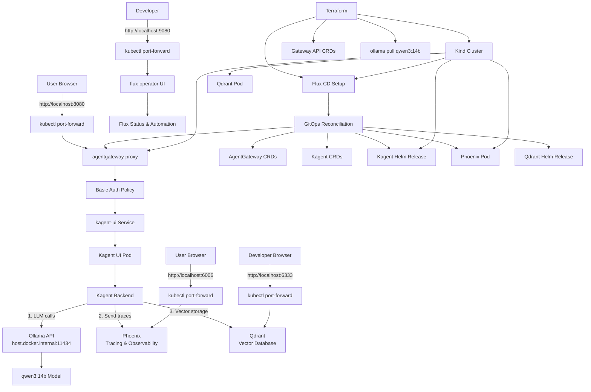

# Kagent AI Agent Platform on Kind with Terraform, Flux, AgentGateway, Phoenix, Qdrant, MCP Governance and Ollama


A complete local Kubernetes-based AI agent platform deployed with **Terraform** and **Flux CD** on a **Kind** cluster. The stack includes **Kagent** for agent interactions, **Phoenix** for distributed tracing and observability, **Qdrant** for vector storage and semantic search, **MCP Governance** for governance control, and **Ollama** for local LLM inference. All components are deployed using **Flux** GitOps for fully declarative infrastructure as code.

This setup is useful for local development, demos, experimentation and validating the deployment flow before moving to a larger Kubernetes environment.

---

## Overview

This project provisions and configures:

- a local **Kind** Kubernetes cluster
- **Gateway API** experimental CRDs
- **Flux CD** for infrastructure as code GitOps
- **AgentGateway** CRDs and controller (managed via Flux)
- **Kagent** CRDs and application (managed via Flux)
- **Phoenix** for distributed tracing and observability (managed via Flux)
- **Qdrant** vector database for semantic search and RAG (managed via Flux)
- **MCP Governance** for governance and MCP control (managed via Flux)
- local **Ollama** model pull for `qwen3:14b`
- Kagent configured to use **Ollama** as the default LLM provider

The infrastructure is managed using **Flux** GitOps approach:

- Terraform handles Kind cluster provisioning, Gateway API, Ollama and Flux setup
- Flux manifests in `infra/` directory manage AgentGateway, Kagent, Phoenix, Qdrant and MCP Governance deployments

### Available User Interfaces

1. **Kagent UI** (port 8080) - AI agent interaction interface
   - Access: `kubectl port-forward -n agentgateway-system svc/agentgateway-proxy 8080:8080`
   - URL: http://localhost:8080
   - Authentication: username `kagent-ui`, password `KagentUI2026!`



2. **AgentGateway Admin UI** (port 15000) - Debug and inspect proxy configuration
   - Access: `kubectl port-forward deploy/agentgateway-proxy -n agentgateway-system 15000:15000`
   - URL: http://localhost:15000/ui/



3. **Phoenix Observability** (port 6006) - Traces and spans for agent interactions
   - Access: `kubectl port-forward -n phoenix svc/phoenix-svc 6006:6006`
   - URL: http://localhost:6006
   - Authentication: username `admin@localhost`, password `Phoenix2026!` (will request change on first login)



4. **Qdrant Vector Database** (port 6333) - Vector database management and retrieval
   - Access: `kubectl port-forward -n qdrant svc/qdrant 6333:6333`
   - URL: http://localhost:6333/dashboard
   - REST API: http://localhost:6333



5. **MCP Governance Dashboard** (port 3000) - Governance and MCP control panel
   - Access: `kubectl port-forward -n mcp-governance svc/mcp-governance-dashboard 3000:3000`
   - URL: http://localhost:3000



6. **Flux Status UI** (port 9080) - Monitor GitOps reconciliation
   - Access: `kubectl port-forward -n flux-system svc/flux-operator 9080:9080`
   - URL: http://localhost:9080



### Access Kagent UI

Kagent UI can be accessed locally through the AgentGateway proxy:

```bash
kubectl port-forward -n agentgateway-system svc/agentgateway-proxy 8080:8080
```

Then open in your browser:

```text
http://localhost:8080
```

**Note:** The UI is protected with basic authentication.

- Username: `kagent-ui`
- Password: `KagentUI2026!`

### Access AgentGateway Admin UI

AgentGateway provides a built-in Admin UI for debugging and inspecting proxy configuration:

```bash
kubectl port-forward deploy/agentgateway-proxy -n agentgateway-system 15000
```

Then open in your browser:

```text
http://localhost:15000/ui/
```

**Features:**

- View configured listeners and port bindings
- Inspect proxy configuration (read-only in Kubernetes mode)
- Test MCP tool calls through the built-in playground

### Access Flux Status UI

To view Flux automation status and reconciliation details:

```bash
kubectl port-forward -n flux-system svc/flux-operator 9080:9080
```

Then open in your browser:

```text
http://localhost:9080
```

### Access Phoenix Observability UI

Phoenix provides distributed tracing and observability for agent interactions:

```bash
kubectl port-forward -n phoenix svc/phoenix-svc 6006:6006
```

Then open in your browser:

```text
http://localhost:6006
```

**Features:**

- View distributed traces from agent interactions
- Inspect spans and timing information
- Monitor agent performance and LLM calls
- Visualize execution flow

**Authentication:**

- Username: `admin@localhost`
- Password: `Phoenix2026!`
- **Note:** The system will request a password change on your first login

### Access Qdrant Vector Database

Qdrant is a vector database for semantic search and retrieval-augmented generation (RAG):

```bash
kubectl port-forward -n qdrant svc/qdrant 6333:6333
```

Then open in your browser:

```text
http://localhost:6333/dashboard
```

Or access the REST API directly:

```text
http://localhost:6333
```

**Features:**

- Vector storage and search
- Vector similarity queries
- Collection management
- Payload filtering and metadata
- Used by agents for knowledge retrieval

**API Documentation:**

Qdrant REST API docs are available at: `http://localhost:6333/api/docs`

### Access MCP Governance Dashboard

MCP Governance provides governance and control management for Model Context Protocol:

```bash
kubectl port-forward -n mcp-governance svc/mcp-governance-dashboard 3000:3000
```

Then open in your browser:

```text
http://localhost:3000
```

**Features:**

- Governance policy management
- MCP control and configuration
- Resource monitoring and planning

## Architecture

The deployment flow is:

1. Terraform creates the local Kind cluster.
2. Terraform installs Flux CD and flux-operator.
3. Gateway API CRDs are installed via Terraform.
4. Flux reconciles manifests from `infra/` directory which includes:
   - AgentGateway CRDs and AgentGateway installation
   - Kagent CRDs and Kagent installation
   - Phoenix for distributed tracing and observability
   - Qdrant for vector storage and semantic search
   - MCP Governance for governance and MCP control
5. Ollama pulls the `qwen3:14b` model on the host machine via Terraform provisioner.
6. Kagent connects to Ollama via `http://host.docker.internal:11434`.
7. The Kagent UI is exposed locally through AgentGateway proxy with basic authentication.
8. Phoenix tracks distributed traces from all agent interactions.
9. Qdrant provides vector database backend for semantic search and RAG capabilities.
10. MCP Governance manages governance policies and MCP control across the platform.

### Block Diagram



---

## Requirements

### Software

Make sure the following tools are installed and available in your `PATH`:

- **Terraform** `>= 1.14`
- **kubectl** compatible with your Kubernetes version
- **Helm** `>= 3.1`
- **Docker** (Docker Engine or Docker Desktop)
- **Ollama**

### System Requirements

Recommended minimum for a smoother experience with `qwen3:14b`:

- **CPU:** modern 8-core CPU or better
- **RAM:** at least **16 GB**, preferably **32 GB**
- **Disk:** at least **20 GB** free space
- **GPU:** a **dedicated GPU** is strongly recommended for better inference speed

### GPU Notes

`qwen3:14b` can be very heavy for a small laptop.

Recommended:

- NVIDIA GPU with sufficient VRAM for local inference
- or a powerful discrete/external GPU setup if your workstation supports it

Without a GPU, the stack may still work in CPU mode, but responses can be slow and host resource usage can be high.

### Networking Notes

This setup expects Kagent to reach Ollama at:

```text
http://host.docker.internal:11434
```

This usually works well with Docker Desktop environments. On some Linux setups, `host.docker.internal` may require additional configuration.

---

## Project Components

The provided Terraform configuration includes:

- `module "kind_cluster"` – creates the local Kind cluster
- `null_resource.install_gatewayapi` – installs Gateway API CRDs from the official release manifest
- `module "flux"` – installs Flux CD and sets up GitOps from this repository
- `null_resource.manage_ollama_model` – pulls the `qwen3:14b` model locally with Ollama

### Flux-Managed Components

The `infra/` directory contains Flux manifests that define:

#### `infra/crds/`

- **agentgateway-crds.yaml** – AgentGateway CRD definitions
- **kagent-crds.yaml** – Kagent CRD definitions

#### `infra/manifests/`

- **agentgateway.yaml** – AgentGateway installation and configuration:
  - `AgentgatewayParameters` – logging configuration
  - `Gateway` (agentgateway-proxy) – HTTP listener on port 8080
  - `AgentgatewayPolicy` – basic authentication for Kagent UI

- **kagent.yaml** – Kagent installation and configuration:
  - Kagent CRD installation
  - Kagent UI and controller deployment
  - HTTPRoute – routes requests to Kagent services
  - Provider configuration for Ollama:
    ```yaml
    providers:
      default: ollama
      ollama:
        provider: "Ollama"
        model: "qwen3:14b"
        config:
          host: "http://host.docker.internal:11434"
    ```

- **phoenix.yaml** – Phoenix distributed tracing and observability:
  - Phoenix Helm Release from OCIRepository (version 5.0.18)
  - PostgreSQL backend for trace storage
  - Authentication enabled (default admin password: `Phoenix2026!`)
  - Collects and visualizes traces, spans, and metrics from agent interactions
  - Provides insights into LLM performance and agent execution flow

- **qdrant.yaml** – Qdrant vector database deployment:
  - Qdrant Helm Release from Helm Repository (version 1.17.0)
  - Vector storage for semantic search and RAG capabilities
  - Single-replica deployment optimized for local development
  - 10GB persistent storage for vector collections
  - REST API and dashboard available for collection management

The Flux system automatically reconciles these manifests from the Git repository, providing continuous deployment and declarative infrastructure management.

---

## Prerequisites

Before deployment:

1. Start Docker.
2. Make sure Kind can create clusters locally.
3. Install and start Ollama.
4. Verify Ollama is reachable:

```bash
ollama list
curl http://localhost:11434/api/tags
```

5. Ensure Terraform can access your Kubernetes and Helm providers.

---

## Initialization

Initialize Terraform in the project directory:

```bash
terraform init
```

Validate the configuration:

```bash
terraform validate
```

Review the execution plan:

```bash
terraform plan
```

---

## Deployment

Apply the infrastructure:

```bash
terraform apply
```

Terraform will:

- create the Kind cluster
- install Gateway API and Flux CD
- pull the Ollama model `qwen3:14b`
- Flux will then automatically reconcile and install:
  - AgentGateway
  - Kagent
  - Phoenix Observability
  - Qdrant Vector Database

The entire setup is now managed through GitOps with Flux. Check [Verify the Deployment](#verify-the-deployment) section to confirm all components are running.

---

## Verify the Deployment

Check cluster nodes:

```bash
kubectl get nodes
```

Check namespaces:

```bash
kubectl get ns
```

Check Flux system and reconciliation status:

```bash
kubectl get ns flux-system
kubectl get pods -n flux-system
kubectl get helmrelease -A  # View all Helm releases managed by Flux
kubectl get ocirepo -n flux-system  # View OCI repositories
```

Check Kagent resources:

```bash
kubectl get pods -n kagent
kubectl get svc -n kagent
kubectl get helmrelease -n kagent
```

Check AgentGateway resources:

```bash
kubectl get pods -n agentgateway-system
kubectl get svc -n agentgateway-system
kubectl get gateway -n agentgateway-system
kubectl get httproute -n kagent
```

Check Phoenix resources:

```bash
kubectl get pods -n phoenix
kubectl get svc -n phoenix
kubectl get helmrelease -n phoenix
```

Check Qdrant resources:

```bash
kubectl get pods -n qdrant
kubectl get svc -n qdrant
kubectl get helmrelease -n qdrant
```

Check MCP Governance resources:

```bash
kubectl get pods -n mcp-governance
kubectl get svc -n mcp-governance
kubectl get helmrelease -n mcp-governance
```

Verify Flux reconciliation with events:

```bash
kubectl describe helmrelease agentgateway -n agentgateway-system
kubectl describe helmrelease kagent -n kagent
kubectl describe helmrelease phoenix -n phoenix
kubectl describe helmrelease qdrant -n qdrant
kubectl describe helmrelease mcp-governance -n mcp-governance
kubectl logs -n flux-system deployment/flux-operator  # Check Flux operator logs
```

---

## Example Workflow

A typical local workflow with all services:

```bash
# Initialize and deploy
terraform init
terraform plan
terraform apply -auto-approve

# Verify Flux is reconciling
kubectl get pods -n flux-system
kubectl get helmrelease -A

# Access Kagent UI (in a terminal)
kubectl port-forward -n agentgateway-system svc/agentgateway-proxy 8080:8080
# Then open http://localhost:8080

# Access Phoenix Observability (in another terminal)
kubectl port-forward -n phoenix svc/phoenix-svc 6006:6006
# Then open http://localhost:6006

# Access Qdrant Vector Database (in another terminal)
kubectl port-forward -n qdrant svc/qdrant 6333:6333
# Then open http://localhost:6333/dashboard

# Access MCP Governance Dashboard (in another terminal)
kubectl port-forward -n mcp-governance svc/mcp-governance-dashboard 3000:3000
# Then open http://localhost:3000

# Monitor Flux Status UI (optional, in another terminal)
kubectl port-forward -n flux-system svc/flux-operator 9080:9080
# Then open http://localhost:9080

# Debug AgentGateway configuration (optional, in another terminal)
kubectl port-forward deploy/agentgateway-proxy -n agentgateway-system 15000
# Then open http://localhost:15000/ui/
```

Credentials:

- **Kagent UI:** username `kagent-ui`, password `KagentUI2026!`
- **Phoenix:** username `admin@localhost`, password `Phoenix2026!` (change required on first login)

---

## Troubleshooting

### 1. Flux reconciliation failed

Check Flux operator logs and HelmRelease status:

```bash
kubectl logs -n flux-system deployment/flux-operator -f
kubectl describe helmrelease agentgateway -n agentgateway-system
kubectl describe helmrelease kagent -n kagent
```

If manifests are not being applied, check GitRepository:

```bash
kubectl describe gitrepository infra -n flux-system
```

### 2. Ollama is not reachable from Kagent

Check that Ollama is running on the host:

```bash
curl http://localhost:11434/api/tags
```

If Kagent cannot reach `host.docker.internal`, verify your Docker/Kind networking setup.

### 3. Model pull takes a long time

`qwen3:14b` is a large model. Initial download can take significant time depending on bandwidth and disk performance.

Check downloaded models:

```bash
ollama list
```

### 4. Pods are not starting

Inspect pods and events:

```bash
kubectl get pods -A
kubectl describe pod -n kagent <pod-name>
kubectl logs -n kagent <pod-name>
kubectl describe pod -n agentgateway-system <pod-name>
kubectl logs -n agentgateway-system <pod-name>
```

### 5. Port-forward fails

Verify the services exist:

```bash
kubectl get svc -n agentgateway-system      # Check agentgateway-proxy
kubectl get svc -n kagent                   # Check kagent-ui
kubectl get svc -n flux-system              # Check flux-operator
```

Then retry:

```bash
kubectl port-forward -n agentgateway-system svc/agentgateway-proxy 8080:8080
```

### 6. AgentGateway Policy not being applied

Check if the policy is targeting the correct Gateway:

```bash
kubectl get agentgatewaypolicy -n agentgateway-system
kubectl describe agentgatewaypolicy kagent-ui-basic-auth -n agentgateway-system
```

Verify the Gateway name matches the policy targetRef:

```bash
kubectl get gateway -n agentgateway-system
```

### 7. Cannot access AgentGateway Admin UI

The Admin UI is not exposed as a Service. For access, verify the deployment exists and port-forward is correct:

```bash
# Verify agentgateway-proxy deployment exists
kubectl get deploy -n agentgateway-system

# Use deployment name in port-forward
kubectl port-forward deploy/agentgateway-proxy -n agentgateway-system 15000:15000

# Check deployment logs if there are issues
kubectl logs deploy/agentgateway-proxy -n agentgateway-system -f
```

### 8. Phoenix is not starting or not accessible

Check Phoenix pod status and logs:

```bash
kubectl get pods -n phoenix
kubectl describe pod -n phoenix <phoenix-pod-name>
kubectl logs -n phoenix <phoenix-pod-name>
```

Verify Phoenix service exists:

```bash
kubectl get svc -n phoenix
kubectl describe svc phoenix-svc -n phoenix
```

Check HelmRelease status:

```bash
kubectl describe helmrelease phoenix -n phoenix
```

**Note:** Phoenix requires PostgreSQL which is deployed as part of the release. Ensure it has time to initialize.

### 9. Qdrant is not starting or not accessible

Check Qdrant pod status and logs:

```bash
kubectl get pods -n qdrant
kubectl describe pod -n qdrant <qdrant-pod-name>
kubectl logs -n qdrant <qdrant-pod-name>
```

Verify Qdrant service exists:

```bash
kubectl get svc -n qdrant
kubectl describe svc qdrant -n qdrant
```

Check HelmRelease status:

```bash
kubectl describe helmrelease qdrant -n qdrant
```

Check persistent storage:

```bash
kubectl get pvc -n qdrant
kubectl describe pvc -n qdrant
```

### 10. Cannot access Phoenix or Qdrant dashboards

Verify port-forward commands are correct:

```bash
# Phoenix
kubectl port-forward -n phoenix svc/phoenix-svc 6006:6006

# Qdrant
kubectl port-forward -n qdrant svc/qdrant 6333:6333
```

Then access:

- Phoenix: `http://localhost:6006`
- Qdrant: `http://localhost:6333/dashboard`

---

## Cleanup

To destroy the environment:

```bash
terraform destroy
```

This will:

- Destroy the Kind cluster (which removes all Kubernetes resources including Flux-managed applications)
- Trigger the Ollama stop provisioner

**Note:** Flux manifests are automatically cleaned up when the Kind cluster is destroyed, but the Git repository continues to contain the infrastructure definitions.

---

## Notes

- This setup is intended primarily for **local development and testing**.
- Running large local LLMs can consume substantial CPU, memory, disk and GPU resources.
- Phoenix and Qdrant deployments add additional resource requirements for tracing and vector storage.
- Infrastructure is managed through **Flux CD** for declarative GitOps workflow.
- All application deployments (AgentGateway, Kagent, Phoenix, Qdrant) are defined in the `infra/` directory and automatically reconciled by Flux.
- For production-style environments, consider replacing the local Kind + host Ollama pattern with a more robust Kubernetes-based inference backend and managed vector database services.

---

## Repository Goal

This repository demonstrates how to combine:

- **Terraform** for repeatable infrastructure provisioning
- **Flux CD** for GitOps continuous deployment
- **Kind** for local Kubernetes
- **Helm** for application installation (via Flux)
- **Ollama** for local LLM serving
- **Kagent** for agent interaction UI
- **AgentGateway** for gateway-layer capabilities
- **Phoenix** for distributed tracing and observability
- **Qdrant** for vector storage and semantic search

into one reproducible local AI platform with declarative infrastructure management.
